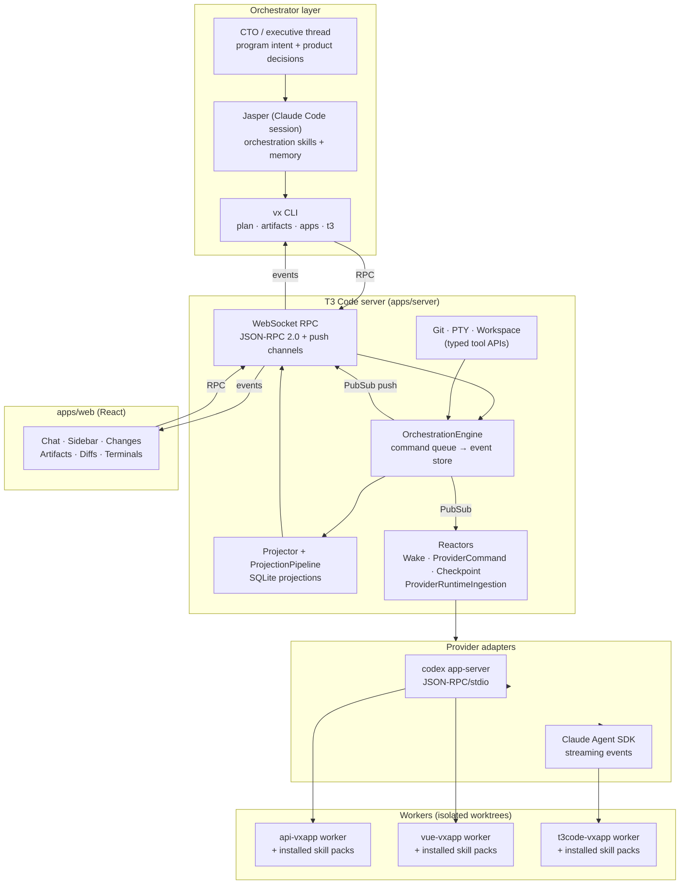
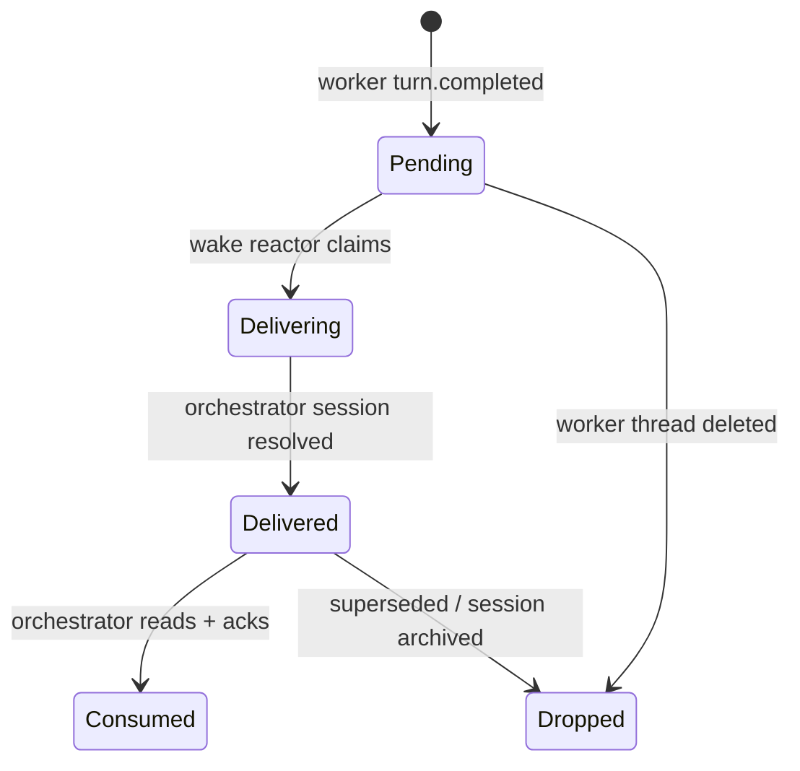
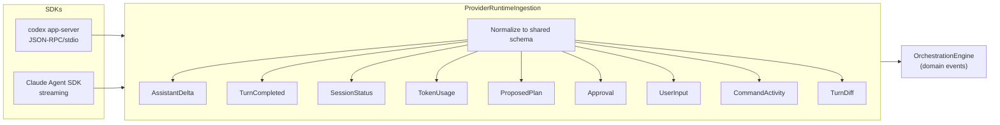
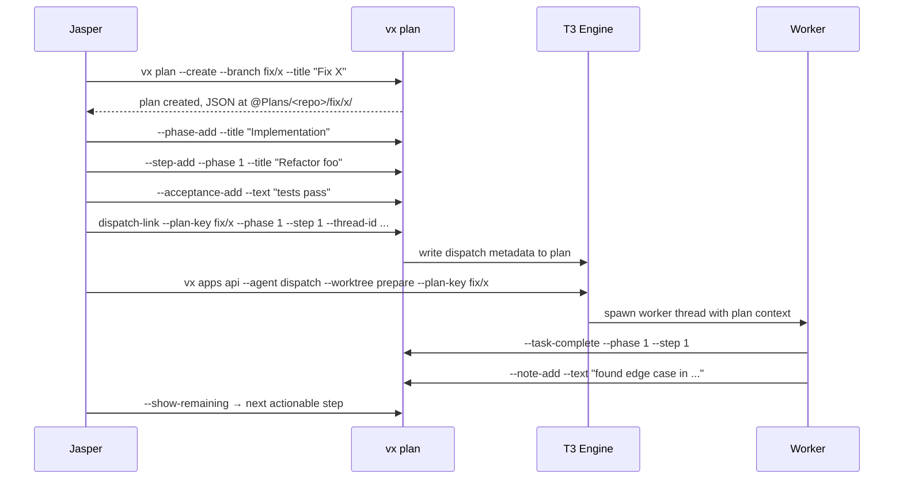

# T3 Code — Vortex Orchestration Workbench

> A heavily-reworked fork of t3code, rebuilt as a **personal multi-repo agentic development control plane**.
> Executive programs, orchestrators, workers, worktrees, wake queues, notifications, plans, TODO state, artifacts, checkpoints, diffs, terminals, and provider sessions — one durable surface.

---

## Table of Contents

1. [Quick Start](#quick-start) — local control-plane commands and state boundaries
2. [Why This Exists](#why-this-exists) — personal multi-codebase agentic development
3. [Pipeline Architecture](#pipeline-architecture) — vx CLI → T3 server → providers, end-to-end
4. [Orchestration Model](#orchestration-model) — concepts, lineage, wake queue state machine
5. [Provider Runtime](#provider-runtime) — Codex + Claude Agent ingestion into orchestration events
6. [Model Selection & Balancing](#model-selection--balancing) — pattern-based routing, fallback chains, rate-limit ledger
7. [Skill Packs](#skill-packs) — selective worker context, runtime contracts, authority gates
8. [Agent Runtime Configuration](#agent-runtime-configuration) — role workspaces, pack profiles, dispatch contracts
9. [Planning Tools — `vx plan`](#planning-tools--vx-plan) — JSON plan DSL, phases, steps, acceptance, dispatch-link
10. [Current-State TODOs (`vx todo`)](#current-state-todos-vx-todo) — JSON continuation state, not legacy backlog
11. [Artifact Tools — `vx artifacts`](#artifact-tools--vx-artifacts) — structured records, task lifecycle, worker summaries
12. [App Wrappers — `vx apps`](#app-wrappers--vx-apps) — per-target dispatch, worktree lanes, deploy, dev-server
13. [T3 Native Control Plane — `vx t3`](#t3-native-control-plane--vx-t3) — direct engine access
14. [Orchestrator Changes Panel](#orchestrator-changes-panel) — live files, diffs, artifacts, plans per thread
15. [UI Surfaces](#ui-surfaces) — sidebar, panels, terminals, settings
16. [Configuration](#configuration) — environment variables, data home
17. [Repo Map](#repo-map) — what lives where
18. [Technical Documentation](#technical-documentation) — linked docs and targeted notes
19. [Dev Checks](#dev-checks) — lint, typecheck, test, contracts

---

## Quick Start

Use `vx apps t3 --dev-server start` to run the managed local server, then `vx t3 doctor` and `vx t3 status` to verify the control plane.

Use `vx apps <repo> --agent dispatch --worktree prepare ...` for repo-bound workers. Use `vx apps <repo> --plan ...` for worker phase state, `vx todo` for current agent continuation state, and `vx artifacts` for durable reports and closeout evidence.

Before completing code changes in this repo, run `bun fmt`, `bun lint`, and `bun typecheck`. Use `bun run test`, not `bun test`, when test execution is required.

---

## Why This Exists

Built for personal use to run a **real agentic development loop across multiple codebases at once** — not a single-agent chat wrapper.

The upstream t3code is a clean browser UI for one assistant at a time. The moment you want Jasper to plan work, dispatch repo-bound workers into worktrees across `api-vxapp`, `vue-vxapp`, `slave-vxapp`, `t3code-vxapp`, etc., watch their turn diffs, route outcomes back through a wake queue, and resume all of it after a restart — the plain chat model falls apart.

This fork is the control plane that makes that loop tractable:

- **Spans repos.** One orchestrator supervises workers checked out in worktrees across every registered repo, each with its own provider session and pack-profile.
- **Durable.** Everything — commands, events, executive programs, notifications, lineage, wake items, plans, artifacts, checkpoints — is event-sourced in SQLite. Restart the server, close the browser, power-cycle the box: state survives.
- **Observable.** The founder/CTO layer can see product-level program decisions and blockers, while Jasper can ask what workers belong to it, what each changed, and which wakes are still pending — without reading terminal scrollback.
- **Wired into `vx`.** The Vortex CLI drives plans, artifacts, dispatch, worktrees, and deployment directly against the T3 engine via WebSocket RPC.
- **Skill-pack aware.** Workers dispatched through `vx apps <repo> --agent dispatch` get a materialized `.claude/skills/` directory selected by role + repo + task class + context mode — not a global mirror. Control-state packs such as `vx todo` are mounted only for lanes that need them.

Opinionated about durable state, structured lineage, and observable orchestration. Built to answer "what is Jasper doing, what have the workers changed, and where are the blockers?" from the system itself.

---

## Pipeline Architecture



Three layers, one protocol:

- **`packages/contracts`** — Effect Schema defines every RPC, event, and projection shape. Nothing crosses the WebSocket without going through it.
- **`apps/server`** — owns the event store, projections, provider adapters, git/PTY/workspace tools, and static web serving.
- **`apps/web`** — renders the live operating surface. No business logic; just view + dispatch.

The `vx` CLI treats the T3 server as the authoritative engine — commands (plan updates, artifact writes, worker dispatch) flow through the same RPC the browser uses, so UI and CLI see the same state.

---

## Orchestration Model



| Concept                  | Meaning                                                                                                                                                                               |
| ------------------------ | ------------------------------------------------------------------------------------------------------------------------------------------------------------------------------------- |
| **Project**              | Workspace root, worktree, or orchestration root                                                                                                                                       |
| **Executive project**    | CTO/founder-facing workspace (`kind: "executive"`) that owns product intent, not worker scheduling                                                                                    |
| **Program**              | Durable executive initiative linking CTO intent to one or more Jasper orchestrator runs                                                                                               |
| **Thread**               | Provider conversation or orchestration lane                                                                                                                                           |
| **Orchestrator**         | Jasper session — holds the `workflowId` and owns workers                                                                                                                              |
| **Worker**               | Thread with explicit `orchestratorProjectId`, `orchestratorThreadId`, `parentThreadId`, `spawnRole`, `spawnedBy`                                                                      |
| **workflowId**           | Groups orchestrator + all workers into one durable run                                                                                                                                |
| **Wake item**            | Worker-outcome record delivered back to the owning orchestrator                                                                                                                       |
| **TODO state**           | Agent-scoped JSON continuation state for current orchestration, stored by `vx todo`; not the legacy markdown backlog                                                                  |
| **Program notification** | CTO-visible program signal (`decision_required`, `blocked`, `milestone_completed`, `closeout_ready`, `risk_escalated`, `status_update`) with severity, state, and structured evidence |

Lineage is structured identifiers only — no title parsing, no heuristics. That is what lets a worker in `/home/gizmo/worktrees/api-fix-auth-01` show up under the Jasper session that spawned it, even though the worker's project is a different repo.

The current executive flow is intentionally layered:

```text
Founder -> CTO executive thread -> Program -> Jasper orchestrator thread -> Workers
```

CTO/program linkage uses `programId`, `executiveProjectId`, and `executiveThreadId`. Worker lineage still belongs to Jasper and uses `orchestratorProjectId`, `orchestratorThreadId`, `parentThreadId`, `spawnRole`, `spawnedBy`, and `workflowId`. Those two relationships are separate on purpose: CTO decides what matters and when a decision is needed; Jasper coordinates execution and worker wake settlement.

Current TODO state follows the same boundary. Jasper owns Jasper `vx todo` continuation records. CTO may inspect, create, update, or steer Jasper-owned TODO state while dispatching, recovering, or correcting a program, but that is executive steering of Jasper's current pointer, not a parallel implementation lane. Repo workers normally do not mutate `vx todo`; they work from JSON plans, dispatch contracts, and artifacts.

Program notifications are not worker wake items. They are durable executive signals stored on the program aggregate with a lifecycle of `pending`, `delivering`, `delivered`, `consumed`, or `dropped`. They let Jasper or an operator surface blockers and decisions to CTO without creating a persistent CTO watcher or bypassing Jasper's orchestration lane.

Worker visibility has two sidebar modes:

- `selected-session` — workers owned by the active orchestrator
- `project-diagnostic` — every worker in the same workspace root, for cross-project runs

Workers with `spawnRole=worker` but missing authoritative Jasper lineage are shown as direct/orphan operations rather than hidden under a healthy orchestrator tree. Normal dispatch guards also reserve `jasper` for primary orchestrator threads; `worker/jasper` is not a valid routine worker path.

---

## Provider Runtime



Provider output is fully normalized before the decider sees it. The engine and projector never touch raw SDK events. Thread runtime has two orthogonal knobs:

- **Runtime mode**: `approval-required` | `full-access`
- **Interaction mode**: `default` | `plan`

---

## Model Selection & Balancing

Model routing is pattern-based and lives in `vortex-scripts/Scripts/@Helpers/t3/data/worker-model-cases.json`. Every worker dispatch is classified against this file and emits the first live-valid (provider, model, effort) tuple.

**Case structure**:

```json
{
  "name": "audit",
  "pattern": "(plan[[:space:]-]*audit|vx-plan-audit|audit)",
  "models": [
    { "provider": "codex", "model": "gpt-5.4", "options": { "reasoningEffort": "high" } },
    { "provider": "claudeAgent", "model": "claude-opus-4-6", "options": { "effort": "high" } },
    { "provider": "claudeAgent", "model": "claude-sonnet-4-6", "options": { "effort": "medium" } }
  ]
}
```

Each case has an **ordered fallback chain** — the selector walks the list and picks the first candidate that is not rate-limited or capped. Defaults to `gpt-5.4` / `claude-sonnet-4-6` at medium effort when nothing matches.

**Shipped cases** (task type → primary model):

| Case                                   | Pattern triggers                                      | Primary model                        |
| -------------------------------------- | ----------------------------------------------------- | ------------------------------------ |
| `plan-path`                            | any plan-bound dispatch                               | `gpt-5.4` / medium                   |
| `tai-research`                         | research, review, knowledge, distill                  | `gpt-5.4-mini` / low                 |
| `read-only-review`                     | review, implementation-review, re-review              | `gpt-5.4` / high                     |
| `audit`                                | plan audit, audit                                     | `gpt-5.4` / high → `opus-4-6` / high |
| `planning`                             | create-plan, vx-plan-create, implementation-plan      | `gpt-5.4` / high                     |
| `architecture`                         | architecture, design-doc                              | `claude-opus-4-6` / high             |
| `source-editing-implementation-refine` | implement, refine, coding, fix-typecheck, repair      | `gpt-5.3-codex-spark` / medium       |
| `test-implementation-refine`           | vx-plan-tests-implement, implement-tests, write-tests | `gpt-5.3-codex-spark` / medium       |
| `control-plane-repair`                 | control-plane, tooling-repair, doctor, worker-model   | `gpt-5.4` / high                     |
| `orchestration-refinement`             | orchestration, jasper, observer, workflow-discipline  | `gpt-5.4` / high                     |
| `closeout`                             | closeout, commit, push, pre-push, shipping-gate       | `gpt-5.4` / medium                   |
| `docs-only`                            | documentation, readme, changelog, ssot                | `gpt-5.4-mini` / low                 |

**Rate-limit & usage ledger** (`t3-worker-model-tracker.sh`):

- Tracks active selections, dispatches, continues, and provider-limit events per (provider, model) tuple
- Persisted at `worker-model-usage.json` — survives CLI restarts
- Caps are loaded from `worker-model-caps.json` (or `VX_T3_WORKER_MODEL_CAPS_JSON`) and consulted before every candidate decision
- When a provider returns a rate-limit message, it is recorded with its reset timestamp; subsequent dispatches automatically skip that tuple until expiry

**Provider/effort validation** (`t3-worker-model-cases.sh`):

- Codex accepts `reasoningEffort ∈ {xhigh, high, medium, low}`
- Claude Agent accepts `effort ∈ {low, medium, high, max, ultrathink}`
- Cross-provider effort values are rejected at normalization time
- Legacy `extra_high` → `xhigh` auto-migrated with warning

Both the T3 server and workers honor the same options, so a case-selected model carried via `vx plan dispatch-link` flows through unchanged into the provider runtime.

---

## Skill Packs

Skill packs are the context packaging layer that keeps worker prompts small without making workers blind.

A normal coding agent has two bad options:

- Give every worker the whole instruction universe, which burns tokens and creates instruction conflicts.
- Give workers a tiny prompt and hope they rediscover repo commands, plans, commit rules, and validation paths by searching.

T3 Code uses a third option: **selective runtime context**. The orchestrator describes the repo, task class, context mode, and closeout authority; the runtime resolver turns that into a bounded set of skill packs; the worker receives only the instructions it needs for that lane.

Each pack is a small folder:

```text
pack-name/
  pack.json        # metadata, scope, capabilities, dependencies
  SKILL.md         # the instructions the agent may load
  references/      # optional deeper material, loaded only when needed
```

That shape matters. `pack.json` is machine-readable, so dispatch can validate the pack before a worker starts. `SKILL.md` is model-readable, so the worker gets the actual operating procedure. `references/` keeps detailed guidance out of the hot path until the model has a reason to open it.

**The core rule:** packs are selected, never dumped.

The resolver combines several signals:

| signal             | why it matters                                                                  |
| ------------------ | ------------------------------------------------------------------------------- |
| role               | an orchestrator, reviewer, implementation worker, and closeout worker differ    |
| repo               | `api-vxapp`, `vue-vxapp`, `t3code-vxapp`, etc. have different commands/rules    |
| task class         | planning, implementation, audit, tests, docs, repair, and closeout need context |
| context mode       | controls whether repo guidance, isolated packs, or review-only packs are used   |
| closeout authority | decides whether the worker can edit, test, commit, push, deploy, or only report |

The result is a worker-local skill surface under the prepared worktree:

```text
.agents/skills/              # selected skills for Codex-compatible runtimes
.claude/skills/              # selected skills for Claude-compatible runtimes
.agents/runtime/
  context-plan.json
  dispatch-contract.json
  installed-packs.json
  instruction-stack-audit.json
```

Those runtime JSON files are the enforcement layer. They let T3 Code answer:

- What context was this worker supposed to receive?
- Which packs were actually installed?
- What capabilities were granted or forbidden?
- Did the resolved instruction stack match the dispatch contract?
- Is this worker allowed to commit, push, deploy, or only leave a report?

That is the difference between "the prompt said be careful" and a dispatch contract the control plane can inspect.

**Pack scopes**:

| scope  | purpose                                                                                          |
| ------ | ------------------------------------------------------------------------------------------------ |
| global | shared command surfaces and lifecycle rules, such as `vx apps`, `vx plan`, `vx t3`, git, deploy  |
| repo   | repo-specific orientation, stack commands, conventions, validation, review, closeout, gotchas    |
| task   | cross-repo specialist context for recurring work types                                           |
| role   | long-lived role skills for Jasper, Observer, Spectator, post-flight, and branch lifecycle agents |

Global packs teach common mechanics. Repo packs teach local truth. Task packs add specialist context. Role skills shape long-running agents like Jasper and Observer. Workers get the selected intersection, not the whole catalog.

**Global pack ranges**:

| range     | purpose                                                                   |
| --------- | ------------------------------------------------------------------------- |
| `000-009` | safety kernel, worker basics, provider/model routing, telemetry           |
| `010-019` | `vx apps` command surface: dispatch, worktrees, artifacts, plans, deploy  |
| `020-029` | `vx plan` lifecycle: create, audit, refine, implement, tests, parallelism |
| `030-039` | `vx t3` control plane: threads, workers, lanes, health, git/workspace RPC |
| `040-049` | artifacts, records, TODO state, docs, knowledge, memory, handoff          |
| `050-059` | source control, closeout authority, GitHub PRs                            |
| `060-069` | dev servers, diagnostics, deployment                                      |
| `070-079` | skill authoring and runtime/bootstrap setup                               |

**Repo pack slots** use the same numbering convention across repos:

| slot      | purpose                                           |
| --------- | ------------------------------------------------- |
| `100`     | repo orientation                                  |
| `101-109` | repo map, stack, conventions, domain rules, risks |
| `110-119` | plan execution, edit rules, validation, blockers  |
| `120-129` | test authoring and test refinement                |
| `130-139` | review, architecture, regression, security        |
| `140-149` | closeout, commit, push, PR, branch hygiene        |
| `150+`    | repo specialists and domain-specific subsystems   |

**Context modes** decide how much the worker inherits:

| mode           | behavior                                                                      |
| -------------- | ----------------------------------------------------------------------------- |
| `isolated`     | minimum viable pack set; worker should be self-contained                      |
| `pack-managed` | packs are the source of truth; broad repo `CLAUDE.md` guidance is suppressed  |
| `repo-guided`  | selected packs plus curated repo guidance                                     |
| `review-only`  | read-only context for audit/review lanes                                      |
| `closeout`     | closeout packs and authority surfaces are available when explicitly permitted |

**Closeout authorities** are separate from instructions:

| authority                | permits                                     |
| ------------------------ | ------------------------------------------- |
| `code_only`              | inspect and edit                            |
| `code_tests`             | inspect, edit, and run local validation     |
| `code_tests_commit`      | code/test authority plus local commit       |
| `code_tests_commit_push` | code/test/commit authority plus branch push |

Separating context from authority is deliberate. A worker may need to know how closeout works without being allowed to push. A reviewer may need repo conventions without edit authority. A cheap implementation worker can follow a precise phase plan without carrying every orchestration policy in its prompt.

At dispatch time, `vortex-scripts` resolves the profile for the target repo, writes the runtime files, installs selected pack symlinks into the worktree, audits the instruction stack, and refuses to start the worker if the selected context is missing or contradictory.

That makes skill packs a scaling primitive: Jasper can dispatch smaller, cheaper, more focused workers because the reusable knowledge lives in audited packs and runtime contracts instead of ever-growing prompts.

---

## Agent Runtime Configuration

Runtime definitions and enforcement are split cleanly:

```
agents-vxapp/agent-runtime/   — canonical source (packs, profiles, schemas, tests)
vortex-scripts/               — resolver, installer, auditor, dispatch integration
agents-vxapp/Jasper/          — Jasper orchestrator workspace
agents-vxapp/Observer/        — external audit/observer workspace
agents-vxapp/Tai/             — research/review agent workspace
worktrees/                    — per-task materialized runtime copies
```

**Role workspaces** — each role is a distinct top-level directory with its own `CLAUDE.md`, `AGENTS.md`, and local `.claude/skills/`:

| role                 | job                                                                                                                                                                                                                                                                                                                                                               |
| -------------------- | ----------------------------------------------------------------------------------------------------------------------------------------------------------------------------------------------------------------------------------------------------------------------------------------------------------------------------------------------------------------- |
| **CTO**              | Executive layer above Jasper. Owns founder intent, product decisions, program state, roadmap, ledger, capability map, and program-level notifications. It may steer Jasper-owned TODO state when needed, but does not schedule normal workers directly.                                                                                                           |
| **Jasper**           | Orchestrator. Plans, dispatches workers, tracks closeouts, owns wake settlement, manages SSOT artifacts, and owns Jasper `vx todo` current-state records. Uses `agents-orchestration`, `agents-multi-project-vx-plan`, `agents-vx-plan-worker-loop`, `agents-t3-dispatch`, `agents-t3-supervision`, `agents-ssot-program-manager`, and 6+ more role-local skills. |
| **Observer**         | External auditor. Evaluates Jasper/T3 behavior from outside, converts repeated failures into new skills or runtime-pack changes, reruns bounded tests. Uses `orchestration-observer`, `orchestration-observer-autonomous`, `orchestration-three-lane-scheduler`, `orchestration-lineage-debug`, `orchestration-review-verdict-recovery`, etc.                     |
| **Tai**              | Research and knowledge distillation. Lightweight, read-only, fast-model default.                                                                                                                                                                                                                                                                                  |
| **Branch lifecycle** | Integration + push-gate closeout skills shared by Jasper and post-flight runs.                                                                                                                                                                                                                                                                                    |
| **Post-flight**      | Verification, status reporting, and follow-up wake routing after a worker completes.                                                                                                                                                                                                                                                                              |

**Skill link resolution**:

1. `agent-runtime/config/role-skill-links.json` defines each role's skill set and source paths.
2. `agent-runtime/tools/sync_role_skill_links.py` materializes them into `<Role>/.claude/skills/` as symlinks.
3. Inheritance works via `include_role_links` (e.g. Jasper inherits the `root` neutral set, then layers its Jasper-local skills).
4. Workers get dispatch-time-computed sets, not role-inherited ones.

**Dispatch contract** (`schemas/dispatch-contract.schema.json`) binds a specific resolved pack list, context mode, closeout authority, grants, and forbids to a worker dispatch. `vortex-scripts` refuses to start a worker whose resolved context doesn't match its declared contract.

CTO uses a separate executive control surface instead of worker dispatch. `vx t3 cto request-orchestration` creates a CTO-owned program envelope and links it to the current Jasper primary orchestrator when present. Jasper remains the only normal owner of worker scheduling and worker wake settlement.

---

## Planning Tools — `vx plan`

Plans are durable JSON documents stored under `$VX_ARTIFACTS_PATH/@Plans/<repo>/<branch>/`. Each plan is a structured spec the orchestrator and workers update over time — not a markdown blob, not `vx todo`, and not the legacy `@Docs/@TODO` backlog.

**Plan shape**:

```
plan
├── metadata (artifactPath, orchestratorThreadId, workerThreadId, branch, workspaceRoot, worktreePath)
├── objective · scope
├── phases[]
│   ├── title
│   ├── steps[] (title, description, status)
│   └── blockers[]
├── acceptance[]
├── constraints[]
└── dispatch[] (per phase/step: providerModel, effort, threadId, runId)
```

**Lifecycle**:



**Command surface**:

| command                                                                | purpose                                                    |
| ---------------------------------------------------------------------- | ---------------------------------------------------------- |
| `--create` / `--branch` / `--title` / `--objective` / `--scope`        | new plan                                                   |
| `--phase-add` / `--step-add` / `--acceptance-add` / `--constraint-add` | spec construction                                          |
| `--import-json --content-file`                                         | replace entire spec from generator output                  |
| `--task-complete` / `--task-reopen`                                    | step status mutations                                      |
| `--note-add` / `--block` / `--unblock`                                 | running commentary + blocker tracking                      |
| `--show-remaining`                                                     | count + next actionable step (orchestrator polling target) |
| `--dispatch-link`                                                      | bind a T3 thread/run/model to a phase or step              |
| `--dispatch-status`                                                    | read current dispatch projection for a scope               |
| `current --thread-id`                                                  | reverse-lookup: which plan owns this T3 thread             |
| `--list` / `--search` / `--export`                                     | catalog operations                                         |

Repo-scoped wrapper: `vx apps <repo> --plan <key>` forwards to `vx plan --repo <repo> <key>` with repo context auto-resolved.

---

## Current-State TODOs (`vx todo`)

`vx todo` is the durable JSON continuation surface for current agent state. It is for the live pointer that lets Jasper or CTO recover what is active now, what should happen next, and which JSON plan or program context a continuation belongs to.

Storage is `VX_TODOS_PATH` when set, otherwise `$VX_ARTIFACTS_PATH/@Todos`.

**Use `vx todo` for**:

- Jasper's active task pointer and next action after interruption.
- Recent completed continuation records.
- Links from current orchestration state to JSON plans, SSoTs, or program context.
- CTO steering of Jasper-owned continuation state during dispatch, recovery, or correction.
- Observer diagnostics when stale or missing current-state records are part of the failure.

**Do not use `vx todo` for**:

- Normal repo worker phase or step state; use `vx apps <repo> --plan ...`.
- Worker closeout evidence; use `vx artifacts` or `vx apps <repo> --artifact ...`.
- Human backlog and long-lived tech debt; use `vx-doc-todo` and `@Docs/@TODO/<repo>`.
- A global mirror of every plan task.

**Command surface**:

| command                                                                                   | purpose                                   |
| ----------------------------------------------------------------------------------------- | ----------------------------------------- |
| `vx todo current --agent jasper --json`                                                   | read the active continuation pointer      |
| `vx todo list --agent jasper --status active --json`                                      | list active current-state records         |
| `vx todo recent --agent jasper --status completed --limit 10 --json`                      | inspect recent completions                |
| `vx todo search --agent jasper --query "<terms>" --json`                                  | find matching active or completed records |
| `vx todo create --agent jasper --id <id> --title "<title>" --next-action "<next>" --json` | create a continuation record              |
| `vx todo update <id> --agent jasper --status completed --json`                            | mutate status or continuation fields      |
| `vx todo link-plan <id> --agent jasper --repo <repo> --plan <key> --json`                 | attach current state to a JSON plan       |
| `vx todo unlink-plan <id> --agent jasper --repo <repo> --plan <key> --json`               | remove a plan link                        |

The important boundary is authority, not file format. `vx todo` is current agent execution state. `@Docs/@TODO` is human-facing backlog, tech debt, historical markdown plans, and long-lived deferred work. Jasper should read legacy TODOs only when explicitly asked to inspect backlog/tech debt or when there is no structured state and the task is clearly historical research.

---

## Artifact Tools — `vx artifacts`

Artifacts are the durable records of agentic work — task documents, worker summaries, reports, reviews. Stored under `$VX_ARTIFACTS_PATH/<repo>/`.

**Kinds**: `task` · `worker` · `report` · `other`
**Statuses**: `planned` · `in-progress` · `completed` · `blocked` · `failed` · `manual-verification` · `archived`

**Metadata context** (auto-derived or explicit):

```
planId · planKey · planPath · orchestratorThreadId · projectId
workspaceRoot · branch · currentPhase · currentStep
```

**Command families**:

| family             | commands                                                           | use                                                 |
| ------------------ | ------------------------------------------------------------------ | --------------------------------------------------- |
| **Write**          | `--add`, `--write`, `--view`, `--archive`                          | structured file lifecycle                           |
| **Discover**       | `--list`, `--search`, `--export`                                   | catalog, filter by kind/status/thread/worker/window |
| **Sync**           | `--sync [--push] [--dry-run]`                                      | commit + push artifact changes                      |
| **Task lifecycle** | `--task-start`, `--task-current`, `--task-update`, `--task-status` | orchestrator-managed task state                     |
| **Worker summary** | `--worker-summary`                                                 | end-of-turn structured report from a worker         |

**Task-start derivation** — `vx artifacts --task-start --from-plan fix/x --current-thread` fills in title, summary, plan metadata, thread ID, project, workspace, branch, phase, step automatically. The orchestrator only supplies the intent.

**Task-update** is sectional — each section is a separate file that gets stitched into the artifact:

```
--executive-summary-file
--plans-table-file
--tests-file
--blockers-file
--workers-table-file
--workflow-feedback-file
--next-steps-file
```

The orchestrator can refresh just one section without rewriting the whole document.

---

## App Wrappers — `vx apps`

Per-repo command wrapper that knows the target's capabilities. Every target resolves through a schema-versioned help doc and returns machine-readable JSON on request.

**Documented targets**:

| selector  | repo             | capabilities                                 |
| --------- | ---------------- | -------------------------------------------- |
| `agents`  | `agents-vxapp`   | agent workflows, artifacts, plans, worktrees |
| `api`     | `api-vxapp`      | ↑ + deploy, install                          |
| `kb`      | `kb-vxapp`       | artifacts, docs sync, generic dispatch       |
| `sbr`     | `sbr-vxapp`      | ↑ + worktrees                                |
| `slave`   | `slave-vxapp`    | ↑ + deploy + dev-server                      |
| `t3`      | `t3code-vxapp`   | ↑ + managed dev-server + worktree lanes      |
| `vesta`   | `vesta-vxapp`    | install, plans                               |
| `scripts` | `vortex-scripts` | agents, artifacts, plans, worktrees          |
| `vue`     | `vue-vxapp`      | ↑ + deploy + dev-server                      |

**Action surface per target**:

| action                                                               | purpose                                                               |
| -------------------------------------------------------------------- | --------------------------------------------------------------------- |
| `--status`                                                           | git health overview                                                   |
| `--list`                                                             | configured repo entries                                               |
| `--sync`                                                             | pull latest docs                                                      |
| `--install-dev` / `--install-prod`                                   | bootstrap                                                             |
| `--deploy <env>`                                                     | deploy wrappers where supported                                       |
| `--dev-server start, stop, status, logs`                             | managed local dev runtime                                             |
| `--plan <key>` / `--plan create`                                     | plan operations, delegated to `vx plan`                               |
| `--todo <cmd>`                                                       | target-scoped TODO operations where supported, delegated to `vx todo` |
| `--worktree list, create, prepare, status, restore-guidance, delete` | lane management                                                       |
| `--agent dispatch`                                                   | prepare worktree + dispatch through T3 lane wrapper                   |
| `--artifact <cmd>`                                                   | artifact operations, delegated to `vx artifacts`                      |
| `--capabilities` / `--schema`                                        | machine-readable support matrix                                       |

**Dispatch gate**: write/coding work must go through `vx apps <repo> --agent dispatch --worktree prepare --branch ... --task ...`. Raw `git worktree add` is not dispatch-ready — the CLI refuses to start a worker until `--worktree status --json` reports `prepared=true` (skill packs installed, dependency linkage confirmed, CLAUDE.md fragments rendered).

**T3 dev-server** — `vx apps t3 --dev-server start|logs --follow|stop|status` replaced the old `dev.sh` entrypoint. It runs both server and web processes under a managed supervisor with combined logs.

---

## T3 Native Control Plane — `vx t3`

Direct entry point into the T3 server, independent of the `vx apps` wrappers. Useful for orchestrator introspection, doctor checks, and low-level dispatch.

| group         | commands                                                                                                                                                                            |
| ------------- | ----------------------------------------------------------------------------------------------------------------------------------------------------------------------------------- |
| **Health**    | `doctor`, `status`, `snapshot`                                                                                                                                                      |
| **Events**    | `events replay [--from N]` — replay domain events from a sequence cursor                                                                                                            |
| **Projects**  | `projects list`, `inspect`, `alias set`, `alias list`, `ensure --workspace`, `delete`                                                                                               |
| **Programs**  | `programs list`, `create`, `update`, `delete`, `notifications`, `notify`, `ack-notification`, `drop-notification`                                                                   |
| **CTO**       | `cto status`, `ensure`, `request-orchestration`, `notifications`, `ack-notification`, `validate-first-task`                                                                         |
| **Threads**   | `threads list`, `current`, `archive-current`, `create`, `start`, `watch`, `status`, `inspect-limit`, `interrupt`, `stop`, `approve`, `reply`, `revert`, `archive`, `delete`, `diff` |
| **Dispatch**  | `dispatch --project ... --task ...` (direct create project+thread+start turn)                                                                                                       |
| **Workers**   | `workers dispatch`, `prompt`, `doctor`, `agents`; routine `--agent jasper` worker dispatch is blocked                                                                               |
| **Lanes**     | `lanes fresh-observer`, `dispatch-worker`, `watch-observer`, `settle-observer`, `run-observer-rerun`                                                                                |
| **Supervise** | `supervise` — one-shot classification for active threads                                                                                                                            |
| **Workspace** | `workspace` — search + write RPC wrappers                                                                                                                                           |
| **Git**       | `git` — status, pull, branches, worktree RPC wrappers                                                                                                                               |
| **Terminal**  | `terminal` — open, write, resize, close                                                                                                                                             |
| **Server**    | `server` — config, settings, provider refresh, keybindings                                                                                                                          |

`vx t3 doctor` is the first port of call on a sick harness: it verifies server URL, auth token, SQLite integrity, and WebSocket round-trip.

CTO/program notification examples:

```bash
vx t3 cto ensure --json
vx t3 cto request-orchestration --title "Ship next slice" --objective "Use Jasper for execution" --json
vx t3 programs notify --program <program-id> --kind decision_required --severity warning --summary "Choose release path" --json
vx t3 cto notifications --program <program-id> --json
vx t3 cto ack-notification --program <program-id> --notification <notification-id> --reason "reviewed" --json
```

Routine snapshots are bounded for stability. Full debug export must be explicitly requested with the debug-export profile and the server-side debug-export allowance.

---

## Orchestrator Changes Panel

Per-thread live view of what a worker actually did — shipped in the web UI. Four live-updating tabs:

| Tab                | Source                                                                        | Content                                                                                                             |
| ------------------ | ----------------------------------------------------------------------------- | ------------------------------------------------------------------------------------------------------------------- |
| **Files Changed**  | git status via server RPC                                                     | add/modify/delete/rename grouped with colors                                                                        |
| **Turn Diffs**     | `orchestration.getTurnDiff`                                                   | line-by-line diff for any completed turn, scoped to the thread                                                      |
| **Artifacts**      | `vx-artifacts` scan of `$VX_ARTIFACTS_PATH/<repo>/` + message-text extraction | discovered docs with section grouping (plans, artifacts, working memory, changelog, reports)                        |
| **Proposed Plans** | thread's `proposedPlan` projection                                            | collapsible cards with preview, download `.md`, "implement" action (spawns a worker with `interactionMode: "plan"`) |

This is the panel the orchestrator reads to decide the next dispatch — files changed + turn diff + artifact summary + plan state, all without leaving the thread.

---

## UI Surfaces

- **Orchestration Sidebar** — Jasper session selector, worker counts scoped to the active orchestrator, cross-project worker visibility, wake summaries, two visibility modes (`selected-session` / `project-diagnostic`).
- **Executive/CTO grouping** — CTO executive projects and program-linked work sit above Jasper orchestrators, so founder-level decisions do not look like worker children.
- **ChatView** — conversation rendering with activity cards, approvals, checkpoint markers, proposed-plan cards, wake notices.
- **ChangesPanel** — the four tabs above.
- **DiffPanel** — full file diff viewer with syntax highlighting.
- **ArtifactPanel** — read and act on discovered artifacts.
- **PlanSidebar** — proposed-plan review surface.
- **TerminalDrawer** — thread-attached PTY with resize/restart/close.
- **Settings** — providers, model slugs, runtime modes, notifications, archived threads, keybindings, project hooks, project scripts.

The sidebar, program metadata, thread metadata, wake queue, notification list, and projections must agree on what belongs to what — the user should never have to reconstruct a run from memory.

---

## Configuration

| Variable                                                        | Purpose                                                                  |
| --------------------------------------------------------------- | ------------------------------------------------------------------------ |
| `T3CODE_PORT`                                                   | HTTP/WebSocket port (deployed default: `7421`)                           |
| `T3CODE_HOST`                                                   | Bind host                                                                |
| `T3CODE_HOME`                                                   | Base directory for T3 data                                               |
| `T3CODE_MODE`                                                   | `development` or `production`                                            |
| `T3CODE_AUTH_TOKEN`                                             | Optional access token                                                    |
| `T3CODE_NO_BROWSER`                                             | Suppress auto browser launch                                             |
| `T3CODE_AUTO_BOOTSTRAP_PROJECT_FROM_CWD`                        | Auto-create project from `cwd` on startup                                |
| `T3CODE_LOG_WS_EVENTS`                                          | Log all WebSocket events (diagnostics)                                   |
| `T3CODE_ALLOW_DEBUG_EXPORT`                                     | Permit full `debug-export` snapshots                                     |
| `VX_ARTIFACTS_PATH`                                             | Root for plans + artifacts storage                                       |
| `VX_TODOS_PATH`                                                 | Optional override for `vx todo`; defaults to `$VX_ARTIFACTS_PATH/@Todos` |
| `VX_T3_WORKER_MODEL_CASES_FILE`                                 | Override model-case policy file                                          |
| `VX_T3_WORKER_MODEL_CAPS_FILE` / `VX_T3_WORKER_MODEL_CAPS_JSON` | Rate-limit caps                                                          |
| `VX_T3_WORKER_MODEL_TRACKER_FILE`                               | Usage ledger location                                                    |

SQLite: `~/.t3/userdata/state.sqlite`

---

## Repo Map

| Path                 | Role                                                                                                                 |
| -------------------- | -------------------------------------------------------------------------------------------------------------------- |
| `apps/server`        | Orchestration engine, event store, projections, reactors, provider adapters, git, terminal, settings, static serving |
| `apps/web`           | React/Vite UI — chat, executive/sidebar state, changes, artifacts, diffs, terminals, settings                        |
| `packages/contracts` | Effect Schema protocol — every RPC, push channel, event, and projection shape                                        |
| `packages/shared`    | Shared runtime utilities (explicit subpath exports, no barrel)                                                       |
| `scripts`            | Build, release, and maintenance helpers                                                                              |
| `docs`               | Design notes, specs, implementation checklists                                                                       |
| `deploy.sh`          | Local build/restart/readiness helper (`--full`, `--build-only`, `--restart-only`, `--status`)                        |

---

## Technical Documentation

| Document                                                                                     | Purpose                                                                                                          |
| -------------------------------------------------------------------------------------------- | ---------------------------------------------------------------------------------------------------------------- |
| [`@Docs/@TechnicalDocs/t3code-vxapp/README.md`](@Docs/@TechnicalDocs/t3code-vxapp/README.md) | Targeted knowledge-bridge integration notes and current caveats.                                                 |
| [`docs/`](docs/)                                                                             | Local design notes, specs, and implementation checklists that are not part of the shared `@Docs` knowledge tree. |

The root README is the current high-level architecture source for orchestration, runtime packs, plans, TODO state, artifacts, and T3 server/UI boundaries.

---

## Dev Checks

```bash
bun fmt
bun lint
bun typecheck
bun run test          # Vitest — use `bun run test`, not `bun test`
bun run build:contracts   # regenerate + validate after protocol changes
```

When request, response, event, provider, orchestration, program/notification, git, terminal, or settings shapes change — update `packages/contracts` first.
