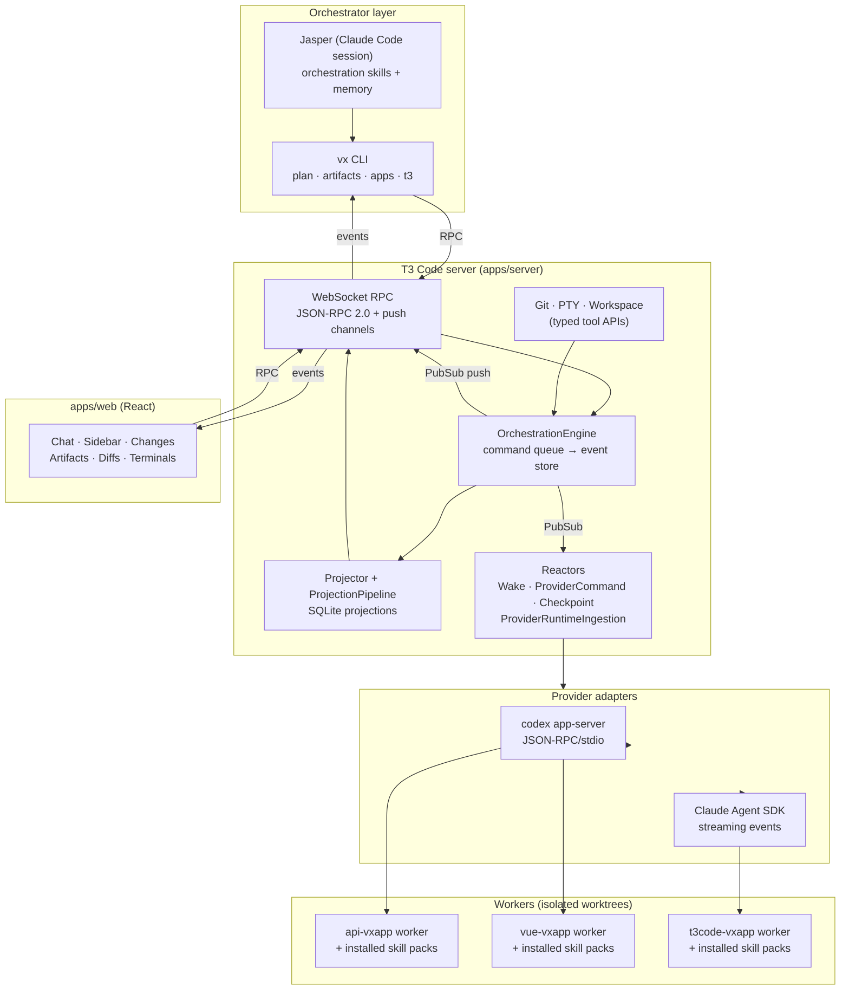
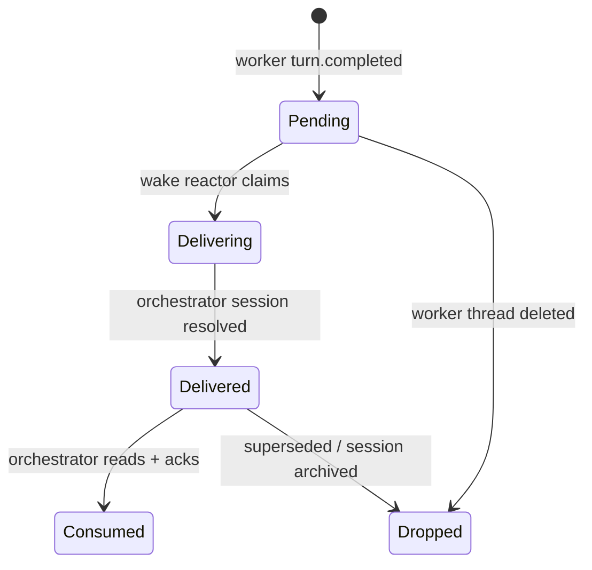
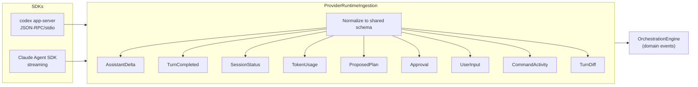
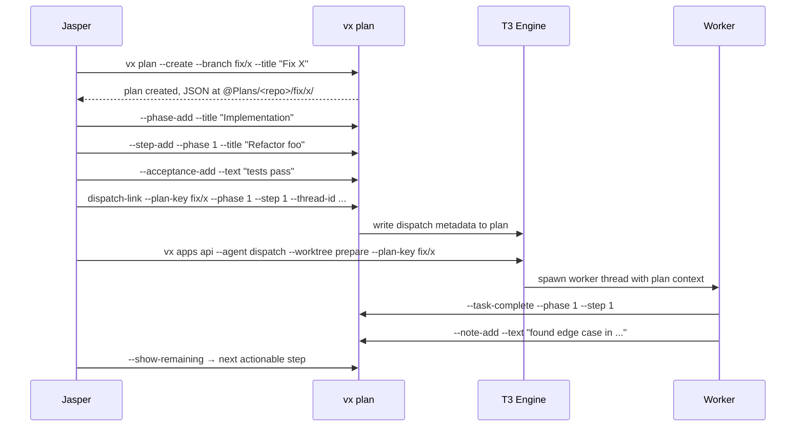

# T3 Code — Vortex Orchestration Workbench

> A heavily-reworked fork of t3code, rebuilt as a **personal multi-repo agentic development control plane**.
> Orchestrators, workers, worktrees, wake queues, plans, artifacts, checkpoints, diffs, terminals, and provider sessions — one durable surface.

---

## Table of Contents

1. [Why This Exists](#why-this-exists) — personal multi-codebase agentic development
2. [Pipeline Architecture](#pipeline-architecture) — vx CLI → T3 server → providers, end-to-end
3. [Orchestration Model](#orchestration-model) — concepts, lineage, wake queue state machine
4. [Provider Runtime](#provider-runtime) — Codex + Claude Agent ingestion into orchestration events
5. [Model Selection & Balancing](#model-selection--balancing) — pattern-based routing, fallback chains, rate-limit ledger
6. [Skill Packs](#skill-packs) — 44 global + 135 repo + 5 task packs, context modes, closeout authorities
7. [Agent Runtime Configuration](#agent-runtime-configuration) — role workspaces, pack profiles, dispatch contracts
8. [Planning Tools — `vx plan`](#planning-tools--vx-plan) — JSON plan DSL, phases, steps, acceptance, dispatch-link
9. [Artifact Tools — `vx artifacts`](#artifact-tools--vx-artifacts) — structured records, task lifecycle, worker summaries
10. [App Wrappers — `vx apps`](#app-wrappers--vx-apps) — per-target dispatch, worktree lanes, deploy, dev-server
11. [T3 Native Control Plane — `vx t3`](#t3-native-control-plane--vx-t3) — direct engine access
12. [Orchestrator Changes Panel](#orchestrator-changes-panel) — live files, diffs, artifacts, plans per thread
13. [UI Surfaces](#ui-surfaces) — sidebar, panels, terminals, settings
14. [Configuration](#configuration) — environment variables, data home
15. [Repo Map](#repo-map) — what lives where
16. [Dev Checks](#dev-checks) — lint, typecheck, test, contracts

---

## Why This Exists

Built for personal use to run a **real agentic development loop across multiple codebases at once** — not a single-agent chat wrapper.

The upstream t3code is a clean browser UI for one assistant at a time. The moment you want Jasper to plan work, dispatch repo-bound workers into worktrees across `api-vxapp`, `vue-vxapp`, `slave-vxapp`, `t3code-vxapp`, etc., watch their turn diffs, route outcomes back through a wake queue, and resume all of it after a restart — the plain chat model falls apart.

This fork is the control plane that makes that loop tractable:

- **Spans repos.** One orchestrator supervises workers checked out in worktrees across every registered repo, each with its own provider session and pack-profile.
- **Durable.** Everything — commands, events, lineage, wake items, plans, artifacts, checkpoints — is event-sourced in SQLite. Restart the server, close the browser, power-cycle the box: state survives.
- **Observable.** The orchestrator can ask the system what Jasper is doing, which workers belong to it, what each has changed, and which wakes are still pending — without reading terminal scrollback.
- **Wired into `vx`.** The Vortex CLI drives plans, artifacts, dispatch, worktrees, and deployment directly against the T3 engine via WebSocket RPC.
- **Skill-pack aware.** Workers dispatched through `vx apps <repo> --agent dispatch` get a materialized `.claude/skills/` directory selected by role + repo + task class + context mode — not a global mirror.

Opinionated about durable state, structured lineage, and observable orchestration. Built to answer "what is Jasper doing, what have the workers changed, and where are the blockers?" from the system itself.

---

## Pipeline Architecture



Three layers, one protocol:

- **`packages/contracts`** — Effect Schema defines every RPC, event, and projection shape. Nothing crosses the WebSocket without going through it.
- **`apps/server`** — owns the event store, projections, provider adapters, git/PTY/workspace tools, and static web serving.
- **`apps/web`** — renders the live operating surface. No business logic; just view + dispatch.

The `vx` CLI treats the T3 server as the authoritative engine — commands (plan updates, artifact writes, worker dispatch) flow through the same RPC the browser uses, so UI and CLI see the same state.

---

## Orchestration Model



| Concept          | Meaning                                                                                                          |
| ---------------- | ---------------------------------------------------------------------------------------------------------------- |
| **Project**      | Workspace root, worktree, or orchestration root                                                                  |
| **Thread**       | Provider conversation or orchestration lane                                                                      |
| **Orchestrator** | Jasper session — holds the `workflowId` and owns workers                                                         |
| **Worker**       | Thread with explicit `orchestratorProjectId`, `orchestratorThreadId`, `parentThreadId`, `spawnRole`, `spawnedBy` |
| **workflowId**   | Groups orchestrator + all workers into one durable run                                                           |
| **Wake item**    | Worker-outcome record delivered back to the owning orchestrator                                                  |

Lineage is structured identifiers only — no title parsing, no heuristics. That is what lets a worker in `/home/gizmo/worktrees/api-fix-auth-01` show up under the Jasper session that spawned it, even though the worker's project is a different repo.

Worker visibility has two sidebar modes:

- `selected-session` — workers owned by the active orchestrator
- `project-diagnostic` — every worker in the same workspace root, for cross-project runs

---

## Provider Runtime



Provider output is fully normalized before the decider sees it. The engine and projector never touch raw SDK events. Thread runtime has two orthogonal knobs:

- **Runtime mode**: `approval-required` | `full-access`
- **Interaction mode**: `default` | `plan`

---

## Model Selection & Balancing

Model routing is pattern-based and lives in `vortex-scripts/Scripts/@Helpers/t3/data/worker-model-cases.json`. Every worker dispatch is classified against this file and emits the first live-valid (provider, model, effort) tuple.

**Case structure**:

```json
{
  "name": "audit",
  "pattern": "(plan[[:space:]-]*audit|vx-plan-audit|audit)",
  "models": [
    { "provider": "codex", "model": "gpt-5.4", "options": { "reasoningEffort": "high" } },
    { "provider": "claudeAgent", "model": "claude-opus-4-6", "options": { "effort": "high" } },
    { "provider": "claudeAgent", "model": "claude-sonnet-4-6", "options": { "effort": "medium" } }
  ]
}
```

Each case has an **ordered fallback chain** — the selector walks the list and picks the first candidate that is not rate-limited or capped. Defaults to `gpt-5.4` / `claude-sonnet-4-6` at medium effort when nothing matches.

**Shipped cases** (task type → primary model):

| Case                                   | Pattern triggers                                      | Primary model                        |
| -------------------------------------- | ----------------------------------------------------- | ------------------------------------ |
| `plan-path`                            | any plan-bound dispatch                               | `gpt-5.4` / medium                   |
| `tai-research`                         | research, review, knowledge, distill                  | `gpt-5.4-mini` / low                 |
| `read-only-review`                     | review, implementation-review, re-review              | `gpt-5.4` / high                     |
| `audit`                                | plan audit, audit                                     | `gpt-5.4` / high → `opus-4-6` / high |
| `planning`                             | create-plan, vx-plan-create, implementation-plan      | `gpt-5.4` / high                     |
| `architecture`                         | architecture, design-doc                              | `claude-opus-4-6` / high             |
| `source-editing-implementation-refine` | implement, refine, coding, fix-typecheck, repair      | `gpt-5.3-codex-spark` / medium       |
| `test-implementation-refine`           | vx-plan-tests-implement, implement-tests, write-tests | `gpt-5.3-codex-spark` / medium       |
| `control-plane-repair`                 | control-plane, tooling-repair, doctor, worker-model   | `gpt-5.4` / high                     |
| `orchestration-refinement`             | orchestration, jasper, observer, workflow-discipline  | `gpt-5.4` / high                     |
| `closeout`                             | closeout, commit, push, pre-push, shipping-gate       | `gpt-5.4` / medium                   |
| `docs-only`                            | documentation, readme, changelog, ssot                | `gpt-5.4-mini` / low                 |

**Rate-limit & usage ledger** (`t3-worker-model-tracker.sh`):

- Tracks active selections, dispatches, continues, and provider-limit events per (provider, model) tuple
- Persisted at `worker-model-usage.json` — survives CLI restarts
- Caps are loaded from `worker-model-caps.json` (or `VX_T3_WORKER_MODEL_CAPS_JSON`) and consulted before every candidate decision
- When a provider returns a rate-limit message, it is recorded with its reset timestamp; subsequent dispatches automatically skip that tuple until expiry

**Provider/effort validation** (`t3-worker-model-cases.sh`):

- Codex accepts `reasoningEffort ∈ {xhigh, high, medium, low}`
- Claude Agent accepts `effort ∈ {low, medium, high, max, ultrathink}`
- Cross-provider effort values are rejected at normalization time
- Legacy `extra_high` → `xhigh` auto-migrated with warning

Both the T3 server and workers honor the same options, so a case-selected model carried via `vx plan dispatch-link` flows through unchanged into the provider runtime.

---

## Skill Packs

Workers don't get a global skill dump. They get a **selected set** materialized into `.claude/skills/` based on role, repo, task class, context mode, and closeout authority.

**Pack inventory** (canonical source: `agents-vxapp/agent-runtime/`):

| scope     | count | purpose                                                                                          |
| --------- | ----: | ------------------------------------------------------------------------------------------------ |
| global    |    44 | shared command-surface + lifecycle packs                                                         |
| repo      |   135 | per-repo orientation, implementation, tests, review, closeout, specialist                        |
| task      |     5 | cross-repo task-specific packs (runtime tools, workspace, websocket control, tracker, telemetry) |
| schemas   |     7 | pack, profile, dispatch-contract, instruction-stack-audit, role-profile, installed-packs         |
| fragments |    20 | runtime-generated CLAUDE.md fragments per repo × mode                                            |

**Global pack numbering**:

| range     | purpose                                                                                                                                    |
| --------- | ------------------------------------------------------------------------------------------------------------------------------------------ |
| `000-009` | safety kernel + T3 worker basics                                                                                                           |
| `010-019` | `vx apps` command surface (base, dispatch, worktree lanes, artifacts, plan, sync, install/deploy)                                          |
| `020-029` | `vx plan` lifecycle (lifecycle, create, audit, refine, implement, implement-phase, review-refine, tests, tests-implement-refine, parallel) |
| `030-039` | `vx t3` control plane (control-plane, dispatch, workers, lanes, health, threads, git/workspace)                                            |
| `040-049` | records, docs, knowledge, memory/handoff                                                                                                   |
| `050-059` | git read, closeout authority, GitHub PR                                                                                                    |
| `060-069` | dev server, diagnostics, deploy authority                                                                                                  |
| `070-079` | skill authoring, Claude Code setup                                                                                                         |

**Repo pack slot convention** (applied to every repo):

| slot      | purpose                                                                                                                 |
| --------- | ----------------------------------------------------------------------------------------------------------------------- |
| `100`     | repo orientation                                                                                                        |
| `101-109` | repo map, stack, conventions, domain, env, risks, escalation                                                            |
| `110-119` | plan execution (implement, phase/step, edit rules, validation, state updates, dependency sequencing, blockers, handoff) |
| `120-129` | test authoring (unit, integration, fixtures, refine, coverage contracts)                                                |
| `130-139` | review (architecture, regression, security, plan-compliance)                                                            |
| `140-149` | closeout (commit, push, PR, branch hygiene)                                                                             |
| `150+`    | repo specialists (e.g. `152-api-agent-tools-runtime`, `154-vue-ui-state-boundaries`, `150-t3-domain-modeling`)          |

**Context modes** — drive how much repo context a worker inherits:

| mode           | effect                                          |
| -------------- | ----------------------------------------------- |
| `isolated`     | minimum viable packs; worker is self-contained  |
| `pack-managed` | packs own all context; no repo-guided CLAUDE.md |
| `repo-guided`  | pack + curated repo CLAUDE.md sections          |
| `review-only`  | read-only inspection set + closeout telemetry   |
| `closeout`     | commit/push/PR surfaces enabled under authority |

**Closeout authorities** — what the worker is allowed to do at end of turn:

| authority                | permits                   |
| ------------------------ | ------------------------- |
| `code_only`              | edit + local tests only   |
| `code_tests`             | code + run test suites    |
| `code_tests_commit`      | ↑ + create commits        |
| `code_tests_commit_push` | ↑ + push branch + open PR |

Every repo has a `pack-profile.json` that maps `task_class × context_mode → packs[] + grants[] + forbids[]`. At dispatch time, `vortex-scripts` resolves the final pack list, materializes symlinks into the worktree's `.claude/skills/`, runs an instruction-stack audit, and only then releases the worker.

---

## Agent Runtime Configuration

Runtime definitions and enforcement are split cleanly:

```
agents-vxapp/agent-runtime/   — canonical source (packs, profiles, schemas, tests)
vortex-scripts/               — resolver, installer, auditor, dispatch integration
agents-vxapp/Jasper/          — Jasper orchestrator workspace
agents-vxapp/Observer/        — external audit/observer workspace
agents-vxapp/Tai/             — research/review agent workspace
worktrees/                    — per-task materialized runtime copies
```

**Role workspaces** — each role is a distinct top-level directory with its own `CLAUDE.md`, `AGENTS.md`, and local `.claude/skills/`:

| role                 | job                                                                                                                                                                                                                                                                                                                                           |
| -------------------- | --------------------------------------------------------------------------------------------------------------------------------------------------------------------------------------------------------------------------------------------------------------------------------------------------------------------------------------------- |
| **Jasper**           | Orchestrator. Plans, dispatches workers, tracks closeouts, manages SSOT artifacts. Uses `agents-orchestration`, `agents-multi-project-vx-plan`, `agents-vx-plan-worker-loop`, `agents-t3-dispatch`, `agents-t3-supervision`, `agents-ssot-program-manager`, and 6+ more role-local skills.                                                    |
| **Observer**         | External auditor. Evaluates Jasper/T3 behavior from outside, converts repeated failures into new skills or runtime-pack changes, reruns bounded tests. Uses `orchestration-observer`, `orchestration-observer-autonomous`, `orchestration-three-lane-scheduler`, `orchestration-lineage-debug`, `orchestration-review-verdict-recovery`, etc. |
| **Tai**              | Research and knowledge distillation. Lightweight, read-only, fast-model default.                                                                                                                                                                                                                                                              |
| **Branch lifecycle** | Integration + push-gate closeout skills shared by Jasper and post-flight runs.                                                                                                                                                                                                                                                                |
| **Post-flight**      | Verification, status reporting, and follow-up wake routing after a worker completes.                                                                                                                                                                                                                                                          |

**Skill link resolution**:

1. `agent-runtime/config/role-skill-links.json` defines each role's skill set and source paths.
2. `agent-runtime/tools/sync_role_skill_links.py` materializes them into `<Role>/.claude/skills/` as symlinks.
3. Inheritance works via `include_role_links` (e.g. Jasper inherits the `root` neutral set, then layers its Jasper-local skills).
4. Workers get dispatch-time-computed sets, not role-inherited ones.

**Dispatch contract** (`schemas/dispatch-contract.schema.json`) binds a specific resolved pack list, context mode, closeout authority, grants, and forbids to a worker dispatch. `vortex-scripts` refuses to start a worker whose resolved context doesn't match its declared contract.

---

## Planning Tools — `vx plan`

Plans are durable JSON documents stored under `$VX_ARTIFACTS_PATH/@Plans/<repo>/<branch>/`. Each plan is a structured spec the orchestrator and workers update over time — not a markdown blob.

**Plan shape**:

```
plan
├── metadata (artifactPath, orchestratorThreadId, workerThreadId, branch, workspaceRoot, worktreePath)
├── objective · scope
├── phases[]
│   ├── title
│   ├── steps[] (title, description, status)
│   └── blockers[]
├── acceptance[]
├── constraints[]
└── dispatch[] (per phase/step: providerModel, effort, threadId, runId)
```

**Lifecycle**:



**Command surface**:

| command                                                                | purpose                                                    |
| ---------------------------------------------------------------------- | ---------------------------------------------------------- |
| `--create` / `--branch` / `--title` / `--objective` / `--scope`        | new plan                                                   |
| `--phase-add` / `--step-add` / `--acceptance-add` / `--constraint-add` | spec construction                                          |
| `--import-json --content-file`                                         | replace entire spec from generator output                  |
| `--task-complete` / `--task-reopen`                                    | step status mutations                                      |
| `--note-add` / `--block` / `--unblock`                                 | running commentary + blocker tracking                      |
| `--show-remaining`                                                     | count + next actionable step (orchestrator polling target) |
| `--dispatch-link`                                                      | bind a T3 thread/run/model to a phase or step              |
| `--dispatch-status`                                                    | read current dispatch projection for a scope               |
| `current --thread-id`                                                  | reverse-lookup: which plan owns this T3 thread             |
| `--list` / `--search` / `--export`                                     | catalog operations                                         |

Repo-scoped wrapper: `vx apps <repo> --plan <key>` forwards to `vx plan --repo <repo> <key>` with repo context auto-resolved.

---

## Artifact Tools — `vx artifacts`

Artifacts are the durable records of agentic work — task documents, worker summaries, reports, reviews. Stored under `$VX_ARTIFACTS_PATH/<repo>/`.

**Kinds**: `task` · `worker` · `report` · `other`
**Statuses**: `planned` · `in-progress` · `completed` · `blocked` · `failed` · `manual-verification` · `archived`

**Metadata context** (auto-derived or explicit):

```
planId · planKey · planPath · orchestratorThreadId · projectId
workspaceRoot · branch · currentPhase · currentStep
```

**Command families**:

| family             | commands                                                           | use                                                 |
| ------------------ | ------------------------------------------------------------------ | --------------------------------------------------- |
| **Write**          | `--add`, `--write`, `--view`, `--archive`                          | structured file lifecycle                           |
| **Discover**       | `--list`, `--search`, `--export`                                   | catalog, filter by kind/status/thread/worker/window |
| **Sync**           | `--sync [--push] [--dry-run]`                                      | commit + push artifact changes                      |
| **Task lifecycle** | `--task-start`, `--task-current`, `--task-update`, `--task-status` | orchestrator-managed task state                     |
| **Worker summary** | `--worker-summary`                                                 | end-of-turn structured report from a worker         |

**Task-start derivation** — `vx artifacts --task-start --from-plan fix/x --current-thread` fills in title, summary, plan metadata, thread ID, project, workspace, branch, phase, step automatically. The orchestrator only supplies the intent.

**Task-update** is sectional — each section is a separate file that gets stitched into the artifact:

```
--executive-summary-file
--plans-table-file
--tests-file
--blockers-file
--workers-table-file
--workflow-feedback-file
--next-steps-file
```

The orchestrator can refresh just one section without rewriting the whole document.

---

## App Wrappers — `vx apps`

Per-repo command wrapper that knows the target's capabilities. Every target resolves through a schema-versioned help doc and returns machine-readable JSON on request.

**Documented targets**:

| selector  | repo             | capabilities                                 |
| --------- | ---------------- | -------------------------------------------- |
| `agents`  | `agents-vxapp`   | agent workflows, artifacts, plans, worktrees |
| `api`     | `api-vxapp`      | ↑ + deploy, install                          |
| `kb`      | `kb-vxapp`       | artifacts, docs sync, generic dispatch       |
| `sbr`     | `sbr-vxapp`      | ↑ + worktrees                                |
| `slave`   | `slave-vxapp`    | ↑ + deploy + dev-server                      |
| `t3`      | `t3code-vxapp`   | ↑ + managed dev-server + worktree lanes      |
| `vesta`   | `vesta-vxapp`    | install, plans                               |
| `scripts` | `vortex-scripts` | agents, artifacts, plans, worktrees          |
| `vue`     | `vue-vxapp`      | ↑ + deploy + dev-server                      |

**Action surface per target**:

| action                             | purpose                                             |
| ---------------------------------- | --------------------------------------------------- | ------- | ------ | ------------------------- | ------- | --------------- |
| `--status`                         | git health overview                                 |
| `--list`                           | configured repo entries                             |
| `--sync`                           | pull latest docs                                    |
| `--install-dev` / `--install-prod` | bootstrap                                           |
| `--deploy <env>`                   | deploy wrappers where supported                     |
| `--dev-server start                | stop                                                | status  | logs`  | managed local dev runtime |
| `--plan <key>` / `--plan create`   | plan operations (delegates to `vx plan`)            |
| `--worktree list                   | create                                              | prepare | status | restore-guidance          | delete` | lane management |
| `--agent dispatch`                 | prepare worktree + dispatch through T3 lane wrapper |
| `--artifact <cmd>`                 | artifact operations (delegates to `vx artifacts`)   |
| `--capabilities` / `--schema`      | machine-readable support matrix                     |

**Dispatch gate**: write/coding work must go through `vx apps <repo> --agent dispatch --worktree prepare --branch ... --task ...`. Raw `git worktree add` is not dispatch-ready — the CLI refuses to start a worker until `--worktree status --json` reports `prepared=true` (skill packs installed, dependency linkage confirmed, CLAUDE.md fragments rendered).

**T3 dev-server** — `vx apps t3 --dev-server start|logs --follow|stop|status` replaced the old `dev.sh` entrypoint. It runs both server and web processes under a managed supervisor with combined logs.

---

## T3 Native Control Plane — `vx t3`

Direct entry point into the T3 server, independent of the `vx apps` wrappers. Useful for orchestrator introspection, doctor checks, and low-level dispatch.

| group         | commands                                                                                                                                                                    |
| ------------- | --------------------------------------------------------------------------------------------------------------------------------------------------------------------------- | --------------------------- | ------- |
| **Health**    | `doctor`, `status`, `snapshot`                                                                                                                                              |
| **Events**    | `events replay [--from N]` — replay domain events from a sequence cursor                                                                                                    |
| **Projects**  | `list`, `inspect`, `alias set                                                                                                                                               | list`, `ensure --workspace` |
| **Threads**   | `list`, `current`, `archive-current`, `create`, `start`, `watch`, `status`, `inspect-limit`, `interrupt`, `stop`, `approve`, `reply`, `revert`, `archive`, `delete`, `diff` |
| **Dispatch**  | `dispatch --project ... --task ...` (direct create project+thread+start turn)                                                                                               |
| **Workers**   | `workers dispatch                                                                                                                                                           | prompt                      | doctor` |
| **Supervise** | `supervise` — one-shot classification for active threads (used by wake-flow post-processing)                                                                                |
| **Workspace** | `workspace` — search + write RPC wrappers                                                                                                                                   |
| **Git**       | `git` — status, pull, branches, worktree RPC wrappers                                                                                                                       |
| **Terminal**  | `terminal` — open, write, resize, close                                                                                                                                     |
| **Server**    | `server` — config, settings, provider refresh, keybindings                                                                                                                  |

`vx t3 doctor` is the first port of call on a sick harness: it verifies server URL, auth token, SQLite integrity, and WebSocket round-trip.

---

## Orchestrator Changes Panel

Per-thread live view of what a worker actually did — shipped in the web UI. Four live-updating tabs:

| Tab                | Source                                                                        | Content                                                                                                             |
| ------------------ | ----------------------------------------------------------------------------- | ------------------------------------------------------------------------------------------------------------------- |
| **Files Changed**  | git status via server RPC                                                     | add/modify/delete/rename grouped with colors                                                                        |
| **Turn Diffs**     | `orchestration.getTurnDiff`                                                   | line-by-line diff for any completed turn, scoped to the thread                                                      |
| **Artifacts**      | `vx-artifacts` scan of `$VX_ARTIFACTS_PATH/<repo>/` + message-text extraction | discovered docs with section grouping (plans, artifacts, working memory, changelog, reports)                        |
| **Proposed Plans** | thread's `proposedPlan` projection                                            | collapsible cards with preview, download `.md`, "implement" action (spawns a worker with `interactionMode: "plan"`) |

This is the panel the orchestrator reads to decide the next dispatch — files changed + turn diff + artifact summary + plan state, all without leaving the thread.

---

## UI Surfaces

- **Orchestration Sidebar** — Jasper session selector, worker counts scoped to the active orchestrator, cross-project worker visibility, wake summaries, two visibility modes (`selected-session` / `project-diagnostic`).
- **ChatView** — conversation rendering with activity cards, approvals, checkpoint markers, proposed-plan cards, wake notices.
- **ChangesPanel** — the four tabs above.
- **DiffPanel** — full file diff viewer with syntax highlighting.
- **ArtifactPanel** — read and act on discovered artifacts.
- **PlanSidebar** — proposed-plan review surface.
- **TerminalDrawer** — thread-attached PTY with resize/restart/close.
- **Settings** — providers, model slugs, runtime modes, notifications, archived threads, keybindings, project hooks, project scripts.

The sidebar, thread metadata, wake queue, and projections must agree on what belongs to what — the user should never have to reconstruct a run from memory.

---

## Configuration

| Variable                                                        | Purpose                                        |
| --------------------------------------------------------------- | ---------------------------------------------- |
| `T3CODE_PORT`                                                   | HTTP/WebSocket port (deployed default: `7421`) |
| `T3CODE_HOST`                                                   | Bind host                                      |
| `T3CODE_HOME`                                                   | Base directory for T3 data                     |
| `T3CODE_MODE`                                                   | `development` or `production`                  |
| `T3CODE_AUTH_TOKEN`                                             | Optional access token                          |
| `T3CODE_NO_BROWSER`                                             | Suppress auto browser launch                   |
| `T3CODE_AUTO_BOOTSTRAP_PROJECT_FROM_CWD`                        | Auto-create project from `cwd` on startup      |
| `T3CODE_LOG_WS_EVENTS`                                          | Log all WebSocket events (diagnostics)         |
| `VX_ARTIFACTS_PATH`                                             | Root for plans + artifacts storage             |
| `VX_T3_WORKER_MODEL_CASES_FILE`                                 | Override model-case policy file                |
| `VX_T3_WORKER_MODEL_CAPS_FILE` / `VX_T3_WORKER_MODEL_CAPS_JSON` | Rate-limit caps                                |
| `VX_T3_WORKER_MODEL_TRACKER_FILE`                               | Usage ledger location                          |

SQLite: `~/.t3/userdata/state.sqlite`

---

## Repo Map

| Path                 | Role                                                                                                                 |
| -------------------- | -------------------------------------------------------------------------------------------------------------------- |
| `apps/server`        | Orchestration engine, event store, projections, reactors, provider adapters, git, terminal, settings, static serving |
| `apps/web`           | React/Vite UI — chat, sidebar, changes, artifacts, diffs, terminals, settings                                        |
| `packages/contracts` | Effect Schema protocol — every RPC, push channel, event, and projection shape                                        |
| `packages/shared`    | Shared runtime utilities (explicit subpath exports, no barrel)                                                       |
| `scripts`            | Build, release, and maintenance helpers                                                                              |
| `docs`               | Design notes, specs, implementation checklists                                                                       |
| `deploy.sh`          | Local build/restart/readiness helper (`--full`, `--build-only`, `--restart-only`, `--status`)                        |

---

## Dev Checks

```bash
bun run typecheck
bun run lint
bun run fmt:check
bun run test          # Vitest — use `bun run test`, not `bun test`
bun run build:contracts   # regenerate + validate after protocol changes
```

When request, response, event, provider, orchestration, git, terminal, or settings shapes change — update `packages/contracts` first.
